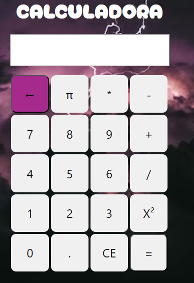

# Calculadora PHP

La calculadora Rayo McQueen, es una calculadora super poderosa que te podra ayudar con tus calculos matematicos sin necesidad de tener que ir por una calculadora normal :D

## Requisitos

Para ejecutar la calculadora en tu entorno local, necesitarás lo siguiente:

- Un servidor web local (por ejemplo, Apache).
- PHP instalado en tu máquina.
- Un editor de código (recomendado Visual Studio Code).
- Y las ganas de aprender su funcionamiento.

## Uso

-Ten en cuenta que debes darle oprimir en los BOTONES cada vez que desees realizar una operación y que de un resultado; la flechita es para eliminar un numero no deseado y el CE es para eliminar todo e iniciar un nuevo calculo.

# Disfruta de la calculadora!!

